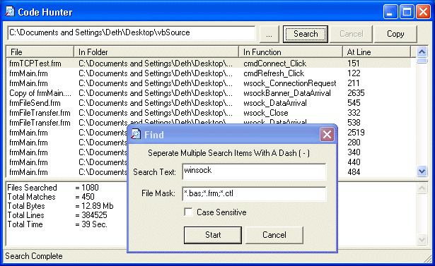

## Code Hunter \(Function Finder\)

### Description

Point This Tool At A Folder And Let It Hunt For That Snippet Of Code For You! If your like me you have a huge library of code stored in a folder somewhere, mostly used for reference for code snippets and examples. The fun part is trying to find that one function you know is there somwhere but arent sure where. Well thats what happened to me one to many times. I created this tool to automate that search, its fast and efficent and uses very little API, mostly just pure vb code. I probably re-invented a wheel with this, but i am seldom happy with other code :) Vote if you find it useful, comment if you find bugs.
 
### More Info
 

             |
---                |---
**Submitted On**   |2003-11-22 09:50:32
**By**             |[Deth](https://github.com/Planet-Source-Code/PSCIndex/blob/master/ByAuthor/deth.md)
**Level**          |Intermediate
**User Rating**    |4.8 (19 globes from 4 users)
**Compatibility**  |VB 6\.0
**Category**       |[Files/ File Controls/ Input/ Output](https://github.com/Planet-Source-Code/PSCIndex/blob/master/ByCategory/files-file-controls-input-output__1-3.md)
**World**          |[Visual Basic](https://github.com/Planet-Source-Code/PSCIndex/blob/master/ByWorld/visual-basic.md)
**Archive File**   |[Code\_Hunte16750011222003\.zip](https://github.com/Planet-Source-Code/deth-code-hunter-function-finder__1-50050/archive/master.zip)

### API Declarations

some api for folder browsing

